# Monolith v2


## 개요

모노리스는 TMA-1 데이터로거와 웹 기반 [Control Hub](https://v2.monolith.luftaquila.io)로 구성된 무선 데이터로깅 플랫폼입니다.

Formula Student 및 Baja Student 대회에 참가하는 학생들의 차량 데이터 수집을 위해 개발되었으나, 다른 분야의 데이터 계측이나 ESP32 개발 보드로도 활용할 수 있습니다.

모든 소스코드와 하드웨어 설계도가 [GitHub](https://github.com/luftaquila/monolith)에 공개되어 있으며, 비상업적 용도에 한해 🍺[Beerware License](https://spdx.org/licenses/Beerware.html)로 자유롭게 사용할 수 있습니다.

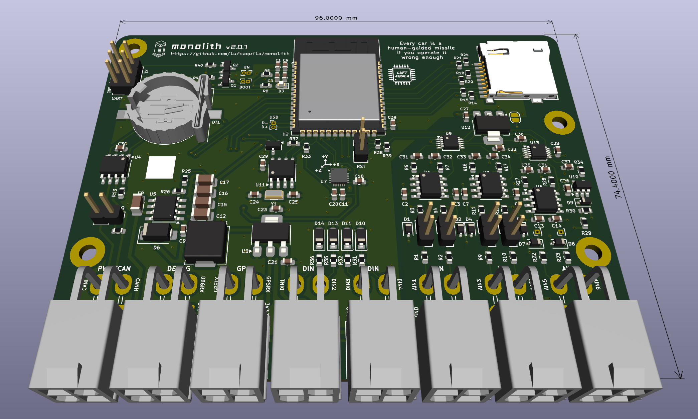

### 기능

📡 무선 통신 지원

* 실시간 텔레메트리
* 로그 데이터 원격 다운로드
* 원격 사용자 이벤트 전송
* 원격 CAN 메시지 전송
* 장치 설정 변경

📀 10 Hz 데이터로깅

* 1x CAN 2.0(A/B)
* 1x 외장 GPS 모듈
* 1x 6축 가속도계 & 자이로
* 4x 디지털 입력
* 6x 아날로그 입력
* 1x 전원 전압 센서
* 1x 칩 온도 센서

💡 웹 기반 데이터 분석 도구

모든 무선 통신 기능은 Wi-Fi 연결이 필요합니다. 차량에서 사용하기 위해서는 드라이버가 Wi-Fi 핫스팟을 켠 휴대폰을 가지고 타야 합니다.

### 미리보기

#### v1 대비 변경사항

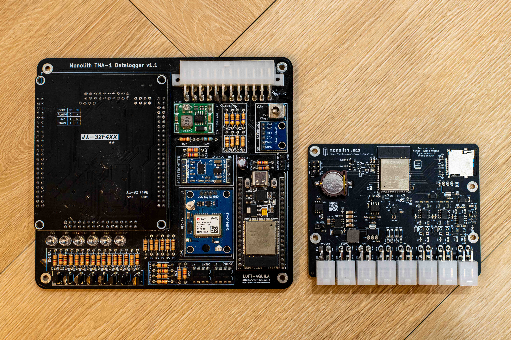

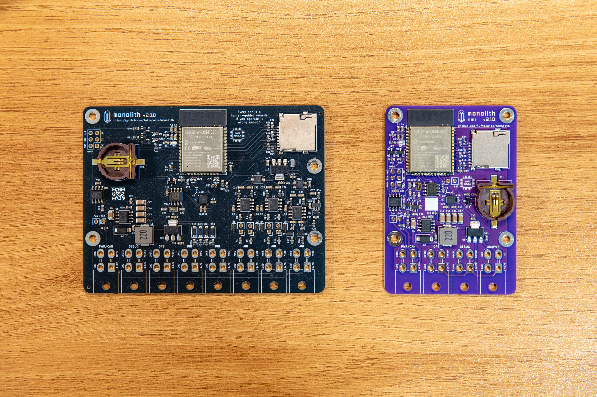

* 크기와 제작 비용이 모두 1/3 수준으로 줄었습니다.
* 성능과 무선통신 안정성이 대폭 개선되었습니다.
* 데이터 추출을 위해 SD카드를 제거할 필요 없이 원격으로 다운로드할 수 있습니다.
* 설정을 바꾸기 위해 펌웨어를 다시 플래싱할 필요 없이 원격으로 수정할 수 있습니다.
* 원격으로 사용자 이벤트와 CAN 메시지 전송이 가능합니다.

## Do It Yourself!

모노리스 TMA-1은 회로도와 PCB 레이아웃이 모두 [device/hardware](https://github.com/luftaquila/monolith/tree/main/device/hardware) 에 공개되어 있습니다.

아래 방법으로 PCB를 직접 제작할 수 있으나, 급하게 필요한 경우를 위해 [https://smartstore.naver.com/luftaquila](https://smartstore.naver.com/luftaquila) 에서도 판매하고 있습니다.

### TMA-1 PCB 제작

1. [Release](https://github.com/luftaquila/monolith/releases/latest)에서 `monolith-{version}.zip`을 다운받고 압축을 해제합니다.
1. [JLCPCB](https://jlcpcb.com/)에서 *pcb/gerbers/GERBER-monolith.zip*을 업로드합니다.
1. 하단의 `PCB Assembly` 스위치를 켭니다.
    * `Mark on PCB`에서 `2D barcode with 5*5mm, Specify Position`을 선택합니다.
    * 다른 옵션은 건드릴 필요가 없습니다. 기판 색상만 원하는 대로 선택합니다.
1. `BOM-monolith.csv`와 `CPL-monolith.csv`를 업로드하고 기판을 주문합니다.
1. PCB에 [Molex 5569-04A2(39300040)](https://www.molex.com/en-us/products/part-detail/39300040) 커넥터 8개를 납땜합니다.
1. CR1220 배터리와 SD 카드를 삽입합니다.
1. `펌웨어 업로드` 항목으로 이동합니다.

<details>

<summary>⭐ PCB 제작 팁</summary>

<h4>PCB 제작 팁</h4>

PCB 제작비를 줄이려면 `BT1` CR1220 배터리 홀더, `L1` 전원부 인덕터, `U2` ESP32 모듈을 조립 항목에서 제외하고, 해당 부품을 따로 구매해 직접 납땜하세요.

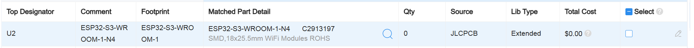

`BT1`과 `L1`을 빼면 부품 종류 1개당 extended component fee $3 을 아낄 수 있습니다.

특히, ESP32-S3 모듈은 조립하려면 **Economic PCB Assembly** 대신 **Standard PCB Assembly**가 필요해 가격이 두 배가 됩니다.

ESP32 모듈은 초심자에게는 직접 납땜하기가 다소 어려울 수 있으나, 이렇게 하면 $60로 완성된 PCB 5장을 생산할 수 있습니다.

반드시 ESP32-S3-WROOM-1 모듈을 사용해야 하며, 8MB 이상의 PSRAM이 내장된 모듈(R8/R16)은 사용할 수 없습니다. 그냥 가장 저렴한 ESP32-S3-WROOM-1-N4 를 사용하면 됩니다.

PCBA Qty를 5에서 2로 조정하면 완성된 기판이 2장만 오는 대신 $20 정도를 추가로 절약할 수 있습니다.

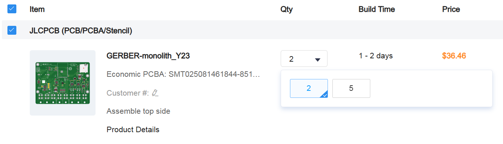

</details>

### 펌웨어 업로드

1. 3.3V UART to USB 컨버터를 준비합니다.
    * ⚠️ 컨버터에는 `RX`, `TX` 외에도 `DTR`, `RTS` 핀이 **반드시** 있어야 합니다.
    * ⚠️ 5V 컨버터는 별도의 3.3V 전압 선택 스위치가 없다면 사용할 수 없습니다.
1. 보드의 UART 커넥터에 2x3 2.54mm 핀 헤더를 납땜합니다.
1. 모노리스의 각 핀을 다음과 같이 연결합니다.
    * `3V3`, `GND`, `DTR`, `RTS`: 컨버터에 있는 같은 이름의 핀과 연결
    * `RX`, `TX`: 컨버터의 핀과 서로 교차하여 연결 (`RX` ↔ `TX`)
1. [esptool](https://github.com/espressif/esptool/releases/latest)을 다운받고 압축을 해제합니다.
1. [Release](https://github.com/luftaquila/monolith/releases/latest)에서 `monolith-{version}.zip`을 다운받고 압축을 해제합니다.
1. `esptool` 바이너리를 압축을 해제한 *firmware/* 디렉터리로 복사합니다.
1. 터미널을 열어 *firmware/* 경로로 이동한 뒤 다음 명령을 실행합니다.\
   `./esptool --chip esp32s3 -b 460800 --before default-reset --after hard-reset write-flash "@flash_args"`

### 서버 준비

TMA-1과 Control Hub가 서로 통신하려면 MQTT 서버(브로커)가 필요합니다.

기본 서버 [v2.monolith.luftaquila.io](https://v2.monolith.luftaquila.io)는 무료로 제공되며, 등록된 사용자만 이용할 수 있습니다.
사용하려면 [mail@luftaquila.io](mailto:mail@luftaquila.io) 로 학교명과 원하는 채널 이름 및 채널 키를 보내주세요.

다만, 기본 서버는 예고 없이 운영이 중단되거나 장애가 발생할 수 있습니다.

<details>

<summary>직접 서버 배포하기</summary>

<h4>서버 배포</h4>

기본 서버를 사용하지 않는다면 상용 MQTT 브로커를 사용하거나 아래 가이드를 따라 직접 서버를 배포해 사용할 수 있습니다.

아래 가이드는 DNS, 방화벽 등 서버 관련 지식이 어느 정도 있다고 가정합니다.

[Docker Engine](https://docs.docker.com/engine/install/)과 [Node.js](https://nodejs.org/en/download)가 설치된 리눅스 머신이 필요합니다.
없다면 [여기](https://www.oracle.com/cloud/free/)서 무료로 인스턴스를 만들 수 있습니다.

이론상 Docker Desktop과 Windows 머신으로도 할 수 있지만, 테스트해본 적은 없습니다.

아래 명령을 실행합니다. `<YOUR_CHANNEL_NAME>`은 사용할 이름으로 변경합니다.

```sh
sudo apt install -y mosquitto
git clone https://github.com/luftaquila/monolith.git

cd monolith/web
npm install
npm run build

cd ../server/config
# set your channel key as the password
mosquitto_passwd -c mosquitto.passwd <YOUR_CHANNEL_NAME>

cd ..
cp .env.example .env
vi .env # set `ACME_EMAIL` and `DOMAIN_NAME` to your own

sudo docker compose up -d
```
</details>

## 사용법

### TMA-1

모노리스 PCB의 8개 커넥터는 모두 [Molex 5569-04A2(39300040)](https://www.molex.com/en-us/products/part-detail/39300040)입니다.
상대물은 [Molex 5557-04R(39012040)](https://www.molex.com/en-us/products/part-detail/39012040)이고, 해당 커넥터의 터미널은 [Molex 5556T(39000038)](https://www.molex.com/en-us/products/part-detail/39000038)입니다.

각 커넥터의 핀 배치는 PCB에 표기되어 있습니다. 잘못 연결하면 장치가 영구적으로 손상될 수 있으니 주의합니다.

#### Specifications

| |MIN|TYP|MAX|UNIT|
|:-:|:-:|:-:|:-:|:-:|
|Supply Voltage|5.5| |36|V|
|Power Consumption| |0.5|1|W|
|Digital Input Voltage|0|5|8.5|V|
|Analog Input Voltage <small>(1)</small>|-0.3| |7.2|V|
|Accelerometer Range|-8| |8|g|
|Gyroscope Range|-500| |500|°/s|

<small>(1) When voltage divide jumper is connected. 1/2 for AIN5, AIN6 and channels with no jumper.</small>

#### Wi-Fi

TMA-1의 무선 통신 기능(실시간 텔레메트리 및 데이터 다운로드 등)을 사용하기 위해서는 2.4GHz Wi-Fi 연결이 필요합니다.

데이터로깅 기능은 Wi-Fi 연결이 없어도 동작합니다. 오프라인으로 사용하려면 주행 이후 SD 카드를 분리하여 PC에 마운트하면 됩니다.

다만 TMA-1의 내부 시계는 네트워크를 통해 SNTP로 자동 동기화되므로, 최소한 한 번은 인터넷에 연결해 시간을 동기화해야 합니다.

##### 초기 설정

1. 장치에 전원을 공급합니다.
1. 첫 부팅 시 `Monolith v2 XXXXXX` 라는 자체 Wi-Fi AP가 생성됩니다. 비밀번호는 `monolith`입니다.
1. 해당 AP에 연결하고 브라우저에서 [http://192.168.4.1](http://192.168.4.1)에 접속합니다.\
   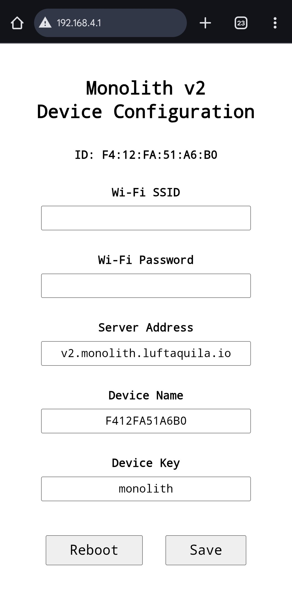
1. TMA-1이 주행 중 연결할 휴대폰(드라이버가 들고 탈 휴대폰)의 핫스팟 정보를 `Wi-Fi SSID`와 `Wi-Fi Password`에 입력합니다.
1. `Server Address`에 사용할 서버 주소를 입력합니다.
    * 기본 서버 [v2.monolith.luftaquila.io](https://v2.monolith.luftaquila.io)는 등록된 사용자만 이용 가능합니다. 사용하려면 학교명과 원하는 채널 이름 및 채널 키를 [mail@luftaquila.io](mailto:mail@luftaquila.io)로 보내주세요.
1. 이메일로 보낸 것과 동일한 값을 `Device Name`과 `Device Key`에 입력합니다.
1. `Save`를 클릭하고 `Reboot`를 클릭합니다.

재부팅 이후 TMA-1은 설정된 Wi-Fi로 연결을 시도합니다.

##### 초기화

Wi-Fi와 서버 설정을 초기화하려면 PCB의 `RST` 점퍼를 3초 이상 합선시켰다가 뗍니다.
Wi-Fi, 서버, 디바이스 이름과 키 등 모든 설정이 초기값으로 복원됩니다.

초기화 후 위 `초기 설정` 단계부터 다시 진행합니다.

#### 전원 및 CAN

`PWR/CAN` 포트는 TMA-1에 전원을 공급하고 CAN 통신 라인을 제공합니다.

전원 핀은 `VIN`, `GND`이며, 동작 중 약 0.5W(40mA @12V)를 소모합니다.

PCB의 `CAN 120Ω` 점퍼를 합선시키면 CAN 버스의 TMA-1측 종단 저항이 활성화됩니다. 사용 중인 CAN 버스의 종단 저항 구성에 맞게 설정합니다.

CAN 버스의 양 끝단에는 120Ω 저항이 각 1개씩 있어야 하며, 이에 따라 `CANH`와 `CANL` 사이의 저항은 60Ω이 되어야 합니다.

#### GPS

TMA-1은 외장 GPS 모듈을 지원합니다.

`GPS` 포트를 UART 방식 GPS 모듈에 아래와 같이 연결합니다.

* `3V3`, `GND`: GPS 모듈 전원
* `GPSRX`, `GPSTX`: GPS 모듈의 `TX` 및 `RX` 와 교차하여 연결

현재 지원하는 GPS 모듈은 U-BLOX NEO-6M/7M/8M 모듈입니다. 추후 필요에 따라 다른 모듈도 추가될 수 있습니다.

#### 디버그 출력

`DEBUG` 포트는 기본적으로 비활성화되어 있으며, 사용자의 필요에 따라 커스텀할 수 있습니다.

기록된 로그를 콕핏 디스플레이 등 다른 MCU에 내보내기 위해 설계되었습니다.

전기적으로는 단순히 여분의 3.3V 0.5A 전원 레일과 GPIO 2개를 제공하는 커넥터이며, 사용자가 사용하기 나름입니다.

#### 디지털 및 아날로그

TMA-1은 4개의 디지털 입력 채널과 6개의 아날로그 입력 채널을 제공합니다. 또한, 총 2.5A를 공급할 수 있는 5V 전원 레일 5개를 제공합니다.

##### 디지털 입력

* LOW: 0 ~ 0.8V
* HIGH: 2.4 ~ 8.5V

디지털 채널은 순간적인 과전압은 버틸 수 있지만, 연속 입력 전압은 8.5V까지로 제한됩니다.

##### 아날로그 입력

아날로그 채널의 최대 입력 전압은 3.6V입니다.

한편, AIN1 ~ AIN4 채널은 선택 가능한 1/2 전압 분배 회로를 가지고 있습니다.
PCB에서 각 AIN 채널에 달린 점퍼를 합선시키면 전압 분배 회로가 활성화되며, 최대 입력 전압이 7.2V로 늘어납니다.

따라서, 최대 5V 전압을 출력하는 센서는 점퍼를 합선시킨 경우에만 사용할 수 있습니다.

AIN5와 AIN6에는 전압 분배 회로가 없으며, 최대 입력 전압은 3.6V로 고정됩니다.

### Control Hub

Control Hub는 [https://v2.monolith.luftaquila.io](https://v2.monolith.luftaquila.io) 에서 무료로 사용할 수 있습니다.

#### Live Telemetry

실시간 텔레메트리를 사용하려면 먼저 `Device Configuration` 탭에서 서버 정보를 설정해야 합니다.

또한, 수신되는 CAN 데이터를 보려면 먼저 `UI Configuration` 탭에서 CAN Decoder를 설정해야 합니다.

서버를 잘 설정했고 TMA-1이 네트워크에 연결되어 있다면 모든 기능은 알아서 잘 작동합니다.

##### Console

사용자 이벤트나 CAN 메시지를 장치로 전송할 수 있습니다.

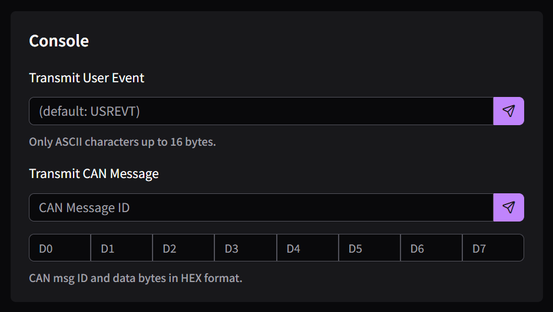

* 사용자 이벤트
    * 사용자 이벤트는 주행 이후 데이터 리뷰에 도움이 되는 의미 있는 지점을 표시합니다.
    * 이벤트를 전송하려면 이름을 입력하고 전송 버튼을 누릅니다.
    * 이벤트 이름을 입력하지 않으면 `USREVT`로 기록됩니다.
    * 이벤트 이름은 16바이트 이하의 ASCII 문자열만 사용 가능합니다.
* CAN 메시지
    * 전송할 CAN 메시지 ID(11/29비트)와 데이터를 입력하고 전송 버튼을 클릭합니다.
    * 입력하지 않은 데이터 바이트들은 `0x00`으로 전송됩니다.

#### Data Viewer

주행 데이터를 열람하려면 먼저 기록을 다운로드해야 합니다.
`Device Configuration` 탭의 `Data Downloader` 섹션을 참고해 데이터를 다운로드합니다.

* `Select`를 눌러 다운받은 `*.log` 파일을 엽니다.
* `Graph` 카드에서 입력 카테고리 버튼이나 범례의 신호 이름을 눌러 그래프를 활성화합니다.
* `GPS` 카드의 슬라이더를 조절하면 차량의 이동 궤적을 볼 수 있습니다.

기록된 CAN 데이터를 보려면 `UI Configuration` 탭에서 CAN Decoder를 먼저 설정해야 합니다.

#### UI Configuration

Live Telemetry와 Data Viewer의 각 카드의 표시 여부를 조정하거나 입력 신호의 이름과 단위, 배율을 설정할 수 있습니다.

변경 사항을 적용하려면 페이지를 새로고침해야 합니다.

##### Import/Export

현재 UI 설정을 내보내고 다른 기기나 브라우저에서 가져올 수 있습니다.

##### Display

Live Telemetry 및 Data Viewer에서 각 카드의 표시 여부를 제어합니다.

##### Units

아날로그 및 CAN 데이터에 사용할 사용자 정의 단위를 관리합니다.

##### Digital

채널 이름을 변경할 수 있습니다.

##### Analog

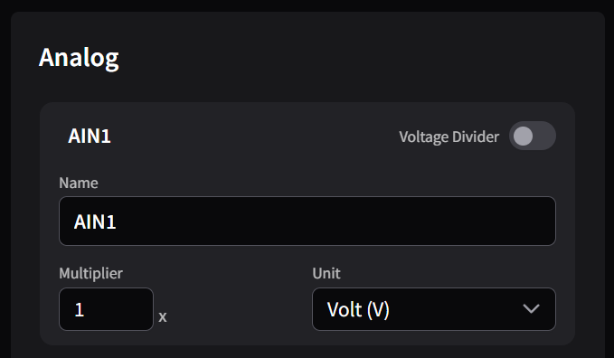

* `Name`: 그래프에 표시할 이름
* `Voltage Divider`: PCB에서 해당 채널의 전압 분배 점퍼를 연결한 경우 스위치를 켭니다.
* `Multiplier`: 측정된 실제 전압에 곱해지는 값입니다. 다음과 같은 경우에 수정합니다.
    * 센서에 추가 전압 분배 회로가 있는 경우
    * 원래 물리량을 계산하는 수식이 있는 경우
* `Unit`: 해당 데이터의 단위. 적절한 단위가 없다면 `Units` 카드에서 추가합니다.

##### CAN

CAN 메시지 디코더를 관리합니다. 디코더는 CAN 페이로드에서 유효한 데이터를 추출합니다.

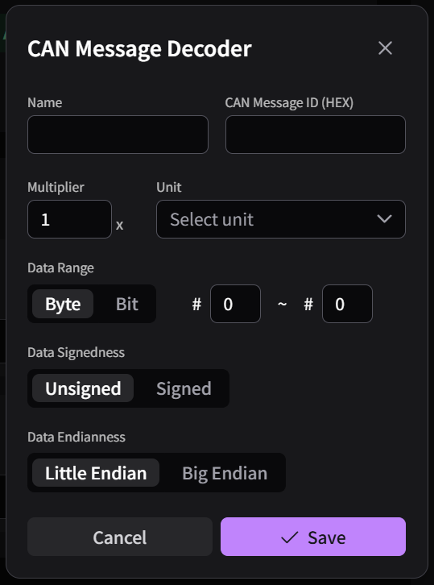

* `Name`: 그래프에 표시할 이름
* `CAN Message ID`: 원하는 데이터가 포함된 CAN 메시지 ID
* `Multiplier`: 원본 값에 곱할 배율
* `Unit`: 해당 데이터의 단위. 적절한 단위가 없다면 `Units` 카드에서 추가합니다.
* `Data Range`: CAN 페이로드에서 데이터가 포함된 범위
    * CAN 페이로드는 최대 8바이트입니다.
        * `Byte` 모드: #0 ~ #7
        * `Bit` 모드: #0 ~ #63
        * 단일 바이트나 비트를 선택하려면 시작과 끝 값을 동일하게 설정합니다.
* `Data Signedness`
    * `Unsigned`: 데이터를 부호 없는 값으로 해석
    * `Signed`: 데이터를 부호 있는 2의 보수로 해석
* `Data Endianness`
    * `Byte` 모드에서만 선택 가능합니다.
    * 멀티바이트 데이터의 엔디언을 정의합니다.

#### Device Configuration

Control Hub가 연결할 서버와 장치 설정을 변경합니다.

장치가 인터넷에 연결되어 있다면 설정값을 자동으로 불러옵니다.

##### Server

* `Address`: Control Hub가 사용할 서버 주소
* `Name` / `Key`: 채널 이름 및 키

모든 값은 `TMA-1 - 초기 설정` 단계에서 장치에 입력한 값과 일치해야 합니다.

저장 버튼을 누르면 자동으로 서버에 연결합니다.

##### Device

* `SSID` / `Password`: TMA-1이 연결할 Wi-Fi 네트워크
* `Timezone`: 지역에 맞는 POSIX 타임존 문자열. [변환기](https://phpsecu.re/tz/)의 `TZ_INFO` 값을 사용하세요.
    * 이 값은 로그 파일 이름에 사용될 시간대를 결정합니다. 기록되는 데이터들의 시간은 UTC를 사용하므로 무관합니다.
* `T. Interval`: 텔레메트리 전송 주기

##### Inputs

디지털 및 아날로그 입력 채널의 로깅 여부를 제어합니다.

##### CAN

* `Enabled`: CAN 버스 로깅 여부
* `Bit rate`: CAN 버스의 Baud rate
* `Filter`: 수신할 메시지 ID (11/29비트)
* `Mask`: 필터의 각 비트에 대한 통과 규칙
    * `0`: 해당하는 필터 비트가 일치해야 통과
    * `1`: 해당하는 필터 비트 값을 무시 (don’t care)

`Filter`와 `Mask`에 대한 자세한 내용은 [ESP32-S3 API Reference](https://docs.espressif.com/projects/esp-idf/en/v5.4.2/esp32s3/api-reference/peripherals/twai.html#acceptance-filter)의 *Acceptance Filter* 항목을 참고하세요. 기본 설정은 모든 CAN 메시지를 허용합니다.

##### GPS

* `Enabled`: GPS 위치 로깅 여부
* `Device`: GPS 모듈 종류를 선택합니다. 현재는 `UBLOX`만 사용 가능합니다.

##### [Danger Zone](https://www.youtube.com/watch?v=siwpn14IE7E)

* `Refresh`: 장치 설정값을 다시 불러옵니다.
    * 변경된 설정은 장치를 재시작해야 적용됩니다.
    * 재시작하기 전에 새로고침하면 이전 설정값이 다시 로드됩니다.
* `Restart`: 장치 재시작
* `Reset`: 장치 초기화 (PCB의 `RST` 점퍼를 합선시키는 것과 동일)

##### Data Downloader

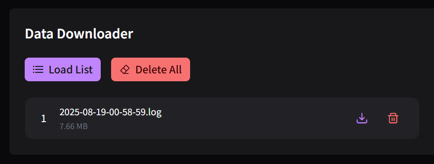

* `Load List`: 현재 세션을 제외한 모든 로그 파일 목록을 불러옵니다.
* `Delete All`: 현재 세션을 제외한 모든 로그 파일을 삭제합니다.

파일 목록을 불러온 뒤, 원하는 파일의 다운로드 버튼을 눌러 해당 파일을 다운로드합니다.

## Development

직접 소프트웨어를 고쳐 사용하고 싶은 경우에만 필요합니다.

<details>

<summary>세부 사항</summary>

<h3>펌웨어</h3>

1. [GitHub 저장소](https://github.com/luftaquila/monolith)에 ⭐를 누릅니다.
1. [ESP-IDF](https://docs.espressif.com/projects/esp-idf/en/stable/esp32s3/get-started/index.html)를 설치하고 아래 명령을 실행합니다.

```
git clone https://github.com/luftaquila/monolith.git
cd monolith/device/firmware
make build
make run   # build & flash
```

<h3>Control Hub</h3>

1. [GitHub 저장소](https://github.com/luftaquila/monolith)에 ⭐를 누릅니다.
1. 아래 명령을 실행합니다.

```
git clone https://github.com/luftaquila/monolith.git
cd monolith/web
npm install
npm run vite
npm run build
```

</details>

## 스폰서

모노리스의 모든 PCB는 PCBWay로부터 프로토타이핑을 지원받아 완성되었습니다.


PCBWay의 경우 PCB 색상으로 흰색과 검은색, 매트 색상을 선택하면 구리 간 최소 간격이 0.22mm 이상이어야 합니다. 가장 최근에 지원받은 v2 mini PCB의 경우 가속도 센서로 사용되는 MPU-6500의 핀 간격이 0.2mm입니다. 검은색으로 주문했으나 이러한 이유로 불가하다는 메일을 받았고, 가장 간단한 해결책은 색깔을 초록, 파랑, 빨강, 보라 중 하나로 변경하는 것이라 가장 안 흔한 보라색으로 선택했습니다.

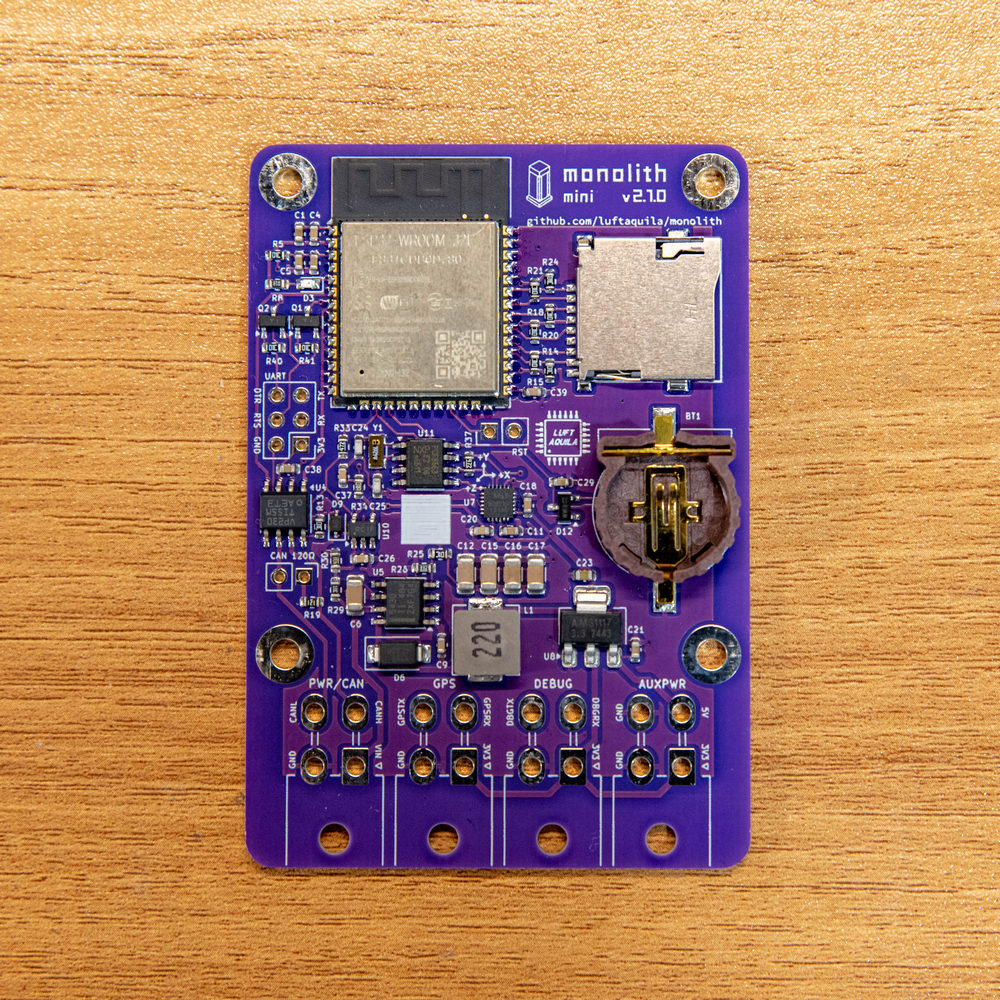

이후 견적 안내, BOM 리스트, 부품 문제 안내 메일을 순서대로 받았고 정상적으로 주문되었습니다. 제작이 완료된 후에는 보드 실물 사진을 다시 메일로 받았고, 주문부터 배송 출발까지는 정확히 2주 소요되었습니다.

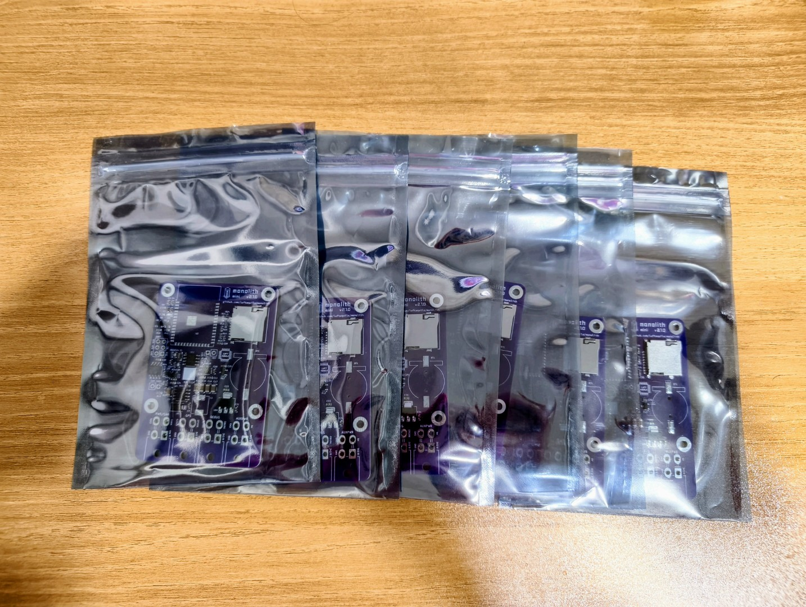

배송받은 PCB는 10장 모두 정전기 방지 포장재에 한 장씩 개별포장되어 왔는데, 항상 뽁뽁이에 감겨 오는것만 보다 개별포장된걸 보니 놀라웠습니다. 테스트해본 기판은 정상작동했고, 모든 SMD 부품은 솔더브릿지같은 문제 없이 잘 실장되어 왔습니다. 실장하지 않은 부품에도 풋프린트 위에 납이 입혀져 와 손으로 납땜하기 쉬웠으며, 보라색 색깔도 아주 맘에 들었습니다.
